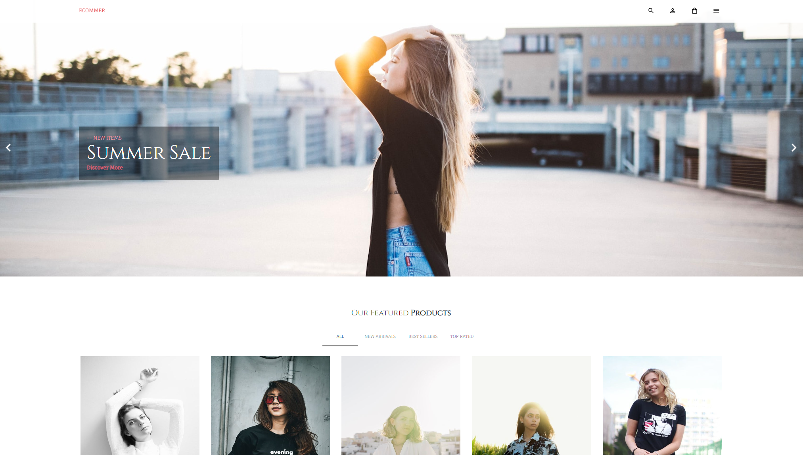

## Nombre del Proyecto

Fashion Online

Página web de venta de indumentaria. EL frontend está construido con React, Material UI, Formik, Yup y el backend con Strapi y Stripe como pasarela de pago.

## Imágenes del Proyecto
  

## Instrucciones

 Es necesario tener instalado `node` y `npm` o `yarn` de manera global, como asi también clonar el backend e instalar las dependencias con el comando `yarn` e iniciar el servidor con `yarn develop`. También deberás cambiar la api key privada de Stripe en el archivo .env del backend.

Instalación:

`npm install`  
`yarn`

Iniciar el servidor local:

`npm start`  
`yarn start`

Visitar el sitio en local:

`localhost:3000/`  
